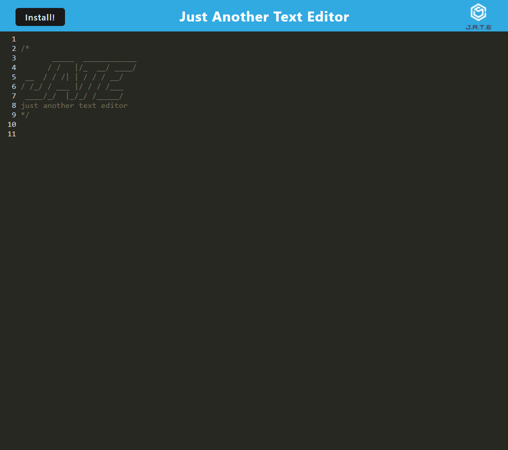
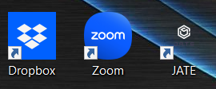
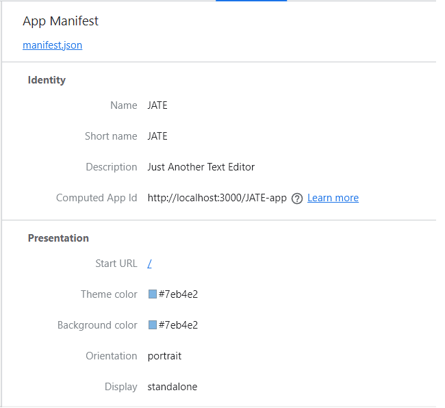
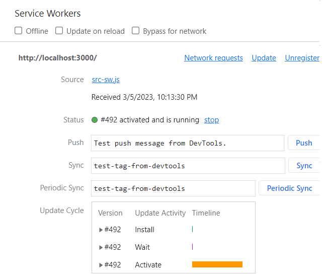
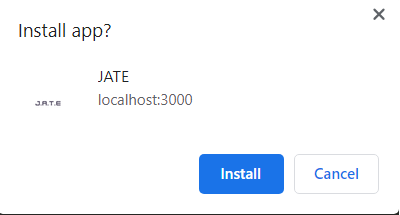

# Text-Editor


## *Description*
___

 

JATE(Just Another Text Editor) is a Progressive Web Application (PWA) that provides users with a simple yet powerful text editor. With JATE, you can create, edit, and save text with ease. The app features a number of data persistence techniques that serve as redundancy in case one of the options is not supported by the browser, ensuring that your data is always safe and accessible.


## *Table of Contents*
 ___
  - [Installation](#installation)
  - [Features](#features)
  - [Usage](#usage)
  - [Software](#software)
  - [Resources](#resources)
  - [License](#license)
  - [Questions](#questions)
  - [Screenshots](#screenshots)

## *Installation*
___
To install JATE for development purposes, follow these guidelines.

1. Clone the repository into your local machine using git.
```
git clone git@github.com:Ccooper9893/Text-Editor.git
```

2. Install the required dependencies by navigating to the project directory and running the following command:
```
npm run install
```

3. Bundle the application code and start the server with following command:
```
npm run start:dev
``` 

## *Features*
___
- Create and edit text documents with a user-friendly interface
- Save documents locally with data persistence options
- Offline functionality ensures that you can use the app even when you're not connected to the internet
- Installable as a standalone app on your device for easy access

## *Usage*
___
To use the application, simply type or edit your text in the provided text editor. The app automatically saves your work continuously through local storage, so you don't need to worry about losing your progress if you accidentally close the app or lose focus on the editor.

To ensure the security and accessibility of your data, the app also uses an indexed database to store your work. The app works offline and supports offline data persistence, meaning your work is saved locally on your device and accessible even without an internet connection.

If you want to access the app quickly, you can install it by clicking on the install button. This will allow you to launch the app from your desktop or home screen.

## *Software*
___
The application is built using various software technologies to ensure that it is efficient, fast, and user-friendly. The main technologies used in building the app include:

- Node.js - an open-source, cross-platform JavaScript runtime environment that executes code outside of a web browser, allowing for efficient server-side development.

- Concurrently - a command-line tool that enables developers to run multiple commands concurrently, making it easier to manage and monitor various tasks during the development process.

- Workbox - a set of libraries and tools that enable developers to build fast, reliable, and offline-capable web applications by providing features such as caching, routing, and offline support.

- Webpack - a module bundler that takes modules with dependencies and generates static assets representing those modules, making it easier to manage and optimize large-scale web applications.

- CodeMirror - a versatile text editor implemented in JavaScript for use in web applications.

- JavaScript, HTML, and CSS - the main programming languages used to create the application's functionality and user interface.

## *Resources*
___
This application is forked from the repository: https://github.com/coding-boot-camp/cautious-meme.git

## *License*
___
This application is covered under the MIT license.

For more information about this license please visit https://opensource.org/licenses/MIT

## *Questions*
___
For comments/concerns please contact me at https://github.com/Ccooper9893

Github Repo: https://github.com/Ccooper9893/Text-Editor

## *Screenshots*
___

JATE User Interface



Downloaded Application



App Manifest



App Service Worker



Installation Prompt


